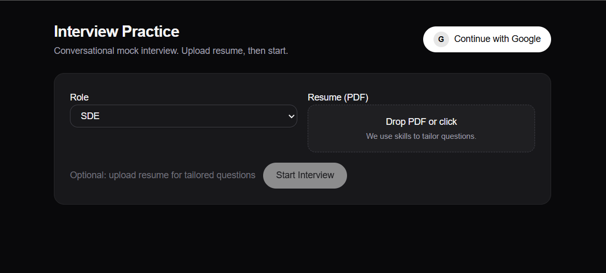
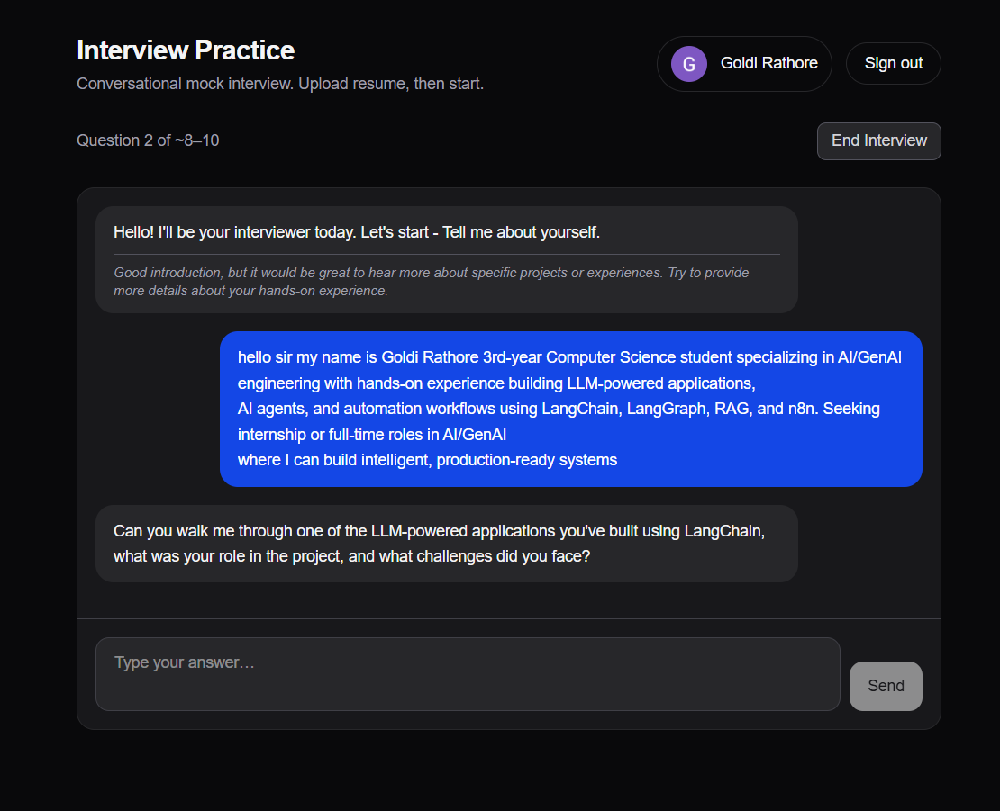

# AI Interview Prep Platform


(screenshots/Screenshot 2026-03-07 170513.png)

**Practice interviews like the real thing.** AI Interview Prep is a full-stack conversational mock interview platform built specifically for freshers. Upload your resume, and an AI interviewer will ask you personalized questions based on your actual projects and skills — one question at a time, just like a real interview.

No more generic question banks. Every interview is tailored to **you**.

---

## Key Features

### Conversational AI Interviewer (Groq + LLaMA 3.3)
Not just a list of questions — a real back-and-forth conversation.
- The AI reads your previous answer and asks a **follow-up question** based on what you said.
- If you mention a project, it digs deeper into that project.
- If your answer is weak, it asks a simpler follow-up to help you improve.

### Resume-Aware Questions
- Upload your resume as a PDF and the platform **automatically extracts your skills**.
- Questions are generated based on **your actual tech stack** — not random topics.
- Fresher-friendly difficulty: project walkthroughs, basic concepts, HR questions.

### Real Interview Flow
The question flow mirrors a real fresher interview:
1. "Tell me about yourself"
2. Project deep-dive questions
3. Basic concept questions from your stack
4. One HR/behavioral question
5. "Do you have any questions for us?"

### Instant Feedback After Every Answer
- Brief AI feedback appears after each answer so you can improve in real-time.
- Final comprehensive feedback at the end with overall score, strengths, and areas to improve.

### Google Authentication
- Secure sign-in with Google via Firebase Authentication.
- Your interview sessions are tied to your account.

---

## Tech Stack

| Layer | Technology |
|-------|-----------|
| **Frontend** | Next.js 14, TypeScript, Tailwind CSS |
| **Backend** | FastAPI, Python |
| **AI / LLM** | Groq API (LLaMA 3.3 70B) |
| **AI Framework** | LangChain, LangGraph |
| **Database** | MongoDB Atlas |
| **Authentication** | Firebase (Google Auth) |
| **PDF Parsing** | PyPDF2 |

---

## How It Works

```
User uploads Resume (PDF)
        ↓
Backend extracts skills using Groq LLM
        ↓
AI Interviewer starts with "Tell me about yourself"
        ↓
User types answer → AI gives brief feedback → Next question
        ↓
After 8-10 questions → Final feedback with score and tips
```

---

## Screenshots

**Setup Screen — Upload Resume and Select Role**


**Live Interview — Conversational Chat UI**



**Final Feedback — Score and Improvement Tips**

---

## Installation and Setup

### Prerequisites
- Python 3.11+
- Node.js 18+
- MongoDB Atlas account (free tier works)
- Groq API key (free at console.groq.com)
- Firebase project with Google Auth enabled

### Backend Setup
```bash
cd backend
python -m venv venv
venv\Scripts\activate        # Windows
pip install -r requirements.txt
uvicorn main:app --reload
```

### Frontend Setup
```bash
cd frontend
npm install
npm run dev
```

### Environment Variables

Create `backend/.env`:
```env
GROQ_API_KEY=your_groq_api_key
MONGODB_URI=your_mongodb_connection_string
FIREBASE_CREDENTIALS=firebase_service_account.json
```

Create `frontend/.env.local`:
```env
NEXT_PUBLIC_FIREBASE_API_KEY=your_key
NEXT_PUBLIC_FIREBASE_AUTH_DOMAIN=your_domain
NEXT_PUBLIC_FIREBASE_PROJECT_ID=your_project_id
NEXT_PUBLIC_FIREBASE_MESSAGING_SENDER_ID=your_sender_id
NEXT_PUBLIC_FIREBASE_APP_ID=your_app_id
NEXT_PUBLIC_BACKEND_URL=http://127.0.0.1:8000
```

Then open your browser at:
```
http://localhost:3000
```

---

## API Endpoints

| Method | Endpoint | Description |
|--------|----------|-------------|
| POST | `/parse-resume` | Upload PDF and extract skills |
| POST | `/start-interview` | Begin interview, get first question |
| POST | `/next-question` | Submit answer, get feedback + next question |
| POST | `/end-interview` | End session, get full feedback report |

---

## Project Structure

```
ai-interview-prep/
├── backend/
│   ├── main.py              # FastAPI server + all endpoints
│   ├── requirements.txt     # Python dependencies
│   └── .env.example         # Environment variable template
├── frontend/
│   ├── app/
│   │   ├── interview/       # Main interview page
│   │   ├── dashboard/       # Progress dashboard
│   │   └── page.tsx         # Landing page
│   ├── components/
│   │   └── LoginButton.tsx  # Google auth button
│   ├── context/
│   │   └── AuthContext.tsx  # Firebase auth state
│   └── lib/
│       └── firebase.ts      # Firebase config
└── README.md
```

---

## Why I Built This

As a fresher preparing for interviews, I noticed that:
- Generic question banks do not match your actual resume
- There is no platform that adapts questions based on your projects
- Real interviews are conversational — not multiple choice

So I built a platform that reads your resume and interviews you exactly like a real interviewer would.

---

## Contributing

Contributions are welcome! Ideas for improvement:
- Voice input for answers (Speech-to-Text)
- Video recording mode
- Company-specific interview modes (Google, Amazon style)
- Leaderboard and streak tracking

Feel free to fork the repo and submit a Pull Request.

---

## License

This project is open-source and available under the [MIT License](LICENSE).

---

*Built by Goldi Rathore — 3rd Year B.Tech CS, ITM Gwalior*

[](https://github.com/goldiii02)
[](https://www.linkedin.com/in/goldirathore/)
